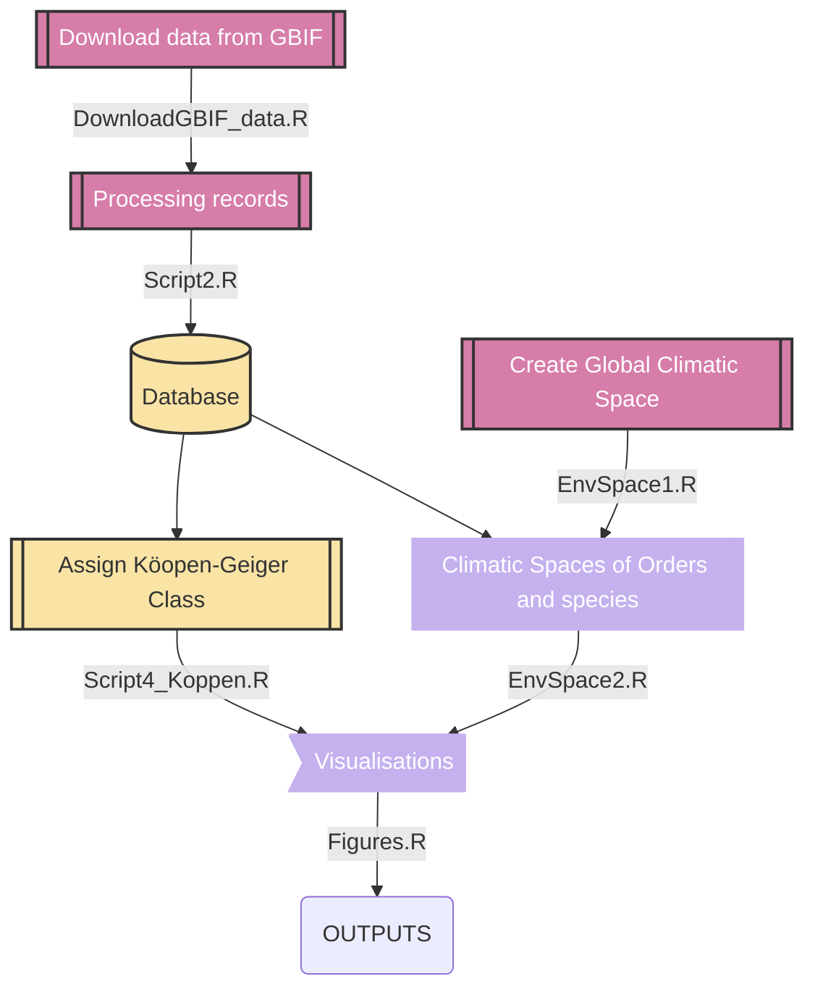

# ClimaticSpace
This repository includes the material (R codes) used for processing, analysing and create the figures of the study 'Assessing the climatic space representation of vascular plants occurrence records based on their publicly available distributional information' written by Ronquillo et al. (2024)
---
# Workflow
The following **diagram** describes the workflow in which the scripts are organized to reproduce the methods sections of the paper.

