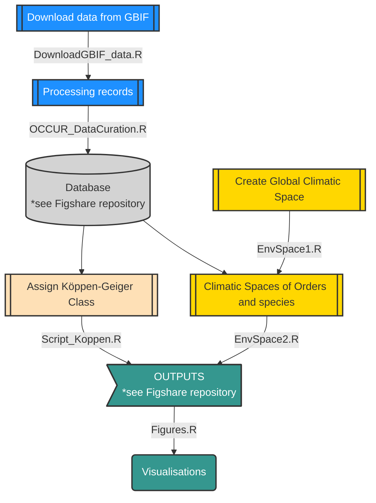

# ClimaticSpace
This repository includes the material (scripts in R language) used for processing, analysing and creating the figures of the study 'Climatic space representation of (occurrence records for) vascular plants based on their geographical distribution' written by Ronquillo et al. (2024)
---
# Workflow
The following **diagram** describes the workflow in which the scripts are organised to reproduce the methods sections of the paper.

